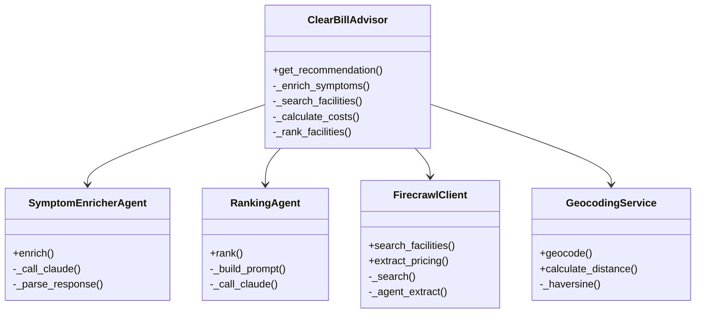
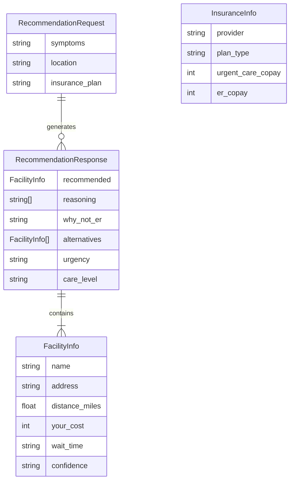

# ClearBill Advisor

> A healthcare vertical agent that tells you where to go and what you'll pay—in seconds.

## The Problem

45 million Americans don't know where to go for care or what it will cost. This leads to $700+ ER bills when urgent care would be $145. Healthcare navigation is broken.

## Solution

ClearBill Advisor uses AI agents to analyze symptoms, discover nearby facilities, extract real-time pricing from websites, and recommend the most cost-effective care option personalized to your insurance.

---

## System Architecture

### High-Level Overview


### Multi-Agent Pipeline (4 Phases)


### Data Flow


---

## Tech Stack

### Backend
| Technology | Purpose |
|------------|---------|
| **Python 3.9+** | Core language |
| **FastAPI** | High-performance async API server |
| **OpenRouter** | Multi-agent orchestration (Claude Haiku/Sonnet) |
| **Firecrawl** | Real-time web scraping & price discovery |
| **Nominatim** | Free geocoding (OpenStreetMap) |
| **Pydantic** | Data validation & serialization |
| **httpx** | Async HTTP client |

### Frontend
| Technology | Purpose |
|------------|---------|
| **Next.js 16** | React framework with App Router |
| **React 19** | UI library |
| **TypeScript** | Type-safe JavaScript |
| **Tailwind CSS v4** | Modern, responsive styling |
| **Framer Motion** | Smooth animations |
| **Lucide React** | Icon library |

### External APIs
| API | Usage |
|-----|-------|
| **OpenRouter** | Claude 3.5 Haiku for symptom analysis & ranking |
| **Firecrawl** | `/search` for discovery, `/agent` for pricing extraction |
| **Nominatim** | Address → coordinates, distance calculation |
| **Reducto** | Insurance card OCR (planned) |

---

## Project Structure

```
clear-bill/
├── backend/                      # Python FastAPI server
│   ├── main.py                   # API endpoints & middleware
│   ├── advisor.py                # 4-phase orchestration pipeline
│   ├── models.py                 # Pydantic data models
│   ├── openrouter_client.py      # Claude AI agents
│   ├── firecrawl_client.py       # Web scraping & price discovery
│   ├── geocoding.py              # Distance calculation service
│   ├── requirements.txt          # Python dependencies
│   ├── test_live_time.py         # Live wait time tests
│   ├── debug_geocoding.py        # Geocoding debug script
│   └── search_results/           # Cached Firecrawl results
│
├── frontend/                     # Next.js React app
│   ├── src/
│   │   └── app/
│   │       ├── page.tsx          # Main UI component
│   │       ├── layout.tsx        # Root layout
│   │       ├── globals.css       # Tailwind + custom styles
│   │       └── api/              # API routes (legacy)
│   ├── package.json              # Dependencies
│   └── next.config.ts            # Next.js configuration
│
├── docs/                         # Documentation
│   └── STEP_1_COMPLETION_REPORT.md
│
├── BLUEPRINT.md                  # Detailed architecture spec
├── LIVE_TIME.md                  # Live wait time feature spec
├── README.md                     # This file
└── .env                          # Environment variables
```

---

## Core Components

### Backend Modules




### API Endpoints

| Endpoint | Method | Description |
|----------|--------|-------------|
| `/health` | GET | Service health check |
| `/advisor/recommend` | POST | Main recommendation endpoint |
| `/facilities/search` | GET | Search facilities by location |
| `/ocr/insurance-card` | POST | Insurance card OCR (stub) |
| `/demo/scenarios` | GET | Predefined test scenarios |
| `/agent/stream` | WebSocket | Real-time agent progress |

### Data Models




---

## Features

### Symptom Analysis
- 4 urgency levels: low, moderate, high, emergency
- Auto-detection of emergencies (chest pain, stroke, severe bleeding)
- Generates optimized search queries for facility discovery
- Returns expected procedures (X-ray, exam, splint, etc.)

### Facility Discovery
- Real-time search via Firecrawl `/search`
- Extracts facility names, URLs, ratings
- Ranks by distance, ratings, and care type match
- Top 3 candidates sent for deep pricing extraction

### Price Extraction
- Autonomous web navigation via Firecrawl `/agent`
- Finds pricing from PDFs, transparency pages, payment portals
- Confidence scoring: "high" (verified) vs "low" (estimated)
- Pre-cached pricing for major chains (Carbon Health, One Medical)

### Geocoding & Distance
- Free Nominatim API (no key required)
- Haversine formula for accurate distances
- Intelligent fallback: address → city → ZIP
- Pre-populated cache for major Bay Area cities

### Insurance Integration
Supports 11 major insurers with copay lookups:
- Anthem PPO/HMO
- Blue Shield PPO/HMO
- Aetna PPO/HMO
- Cigna PPO/HMO
- UnitedHealth PPO/HMO
- Kaiser Permanente
- Medicare
- Uninsured (cash pricing)

### Live Wait Times
- Regex patterns detect: "Wait time: 15 min", "Next available: 2:30 PM"
- Scrapes facility booking/status pages
- Sources: "verified_live" vs "estimated"

---

## Setup Instructions

### Prerequisites
- Python 3.9+
- Node.js 18+
- API keys for OpenRouter and Firecrawl

### Backend Setup

```bash
# Navigate to backend directory
cd backend

# Create virtual environment
python -m venv venv
source venv/bin/activate  # Windows: venv\Scripts\activate

# Install dependencies
pip install -r requirements.txt

# Run the server
uvicorn main:app --reload --port 8000
```

### Frontend Setup

```bash
# Navigate to frontend directory
cd frontend

# Install dependencies
npm install

# Run the development server
npm run dev
```

### Environment Variables

Create `.env` in the project root:

```bash
# Required
OPENROUTER_API_KEY=sk-or-v1-your_key_here
FIRECRAWL_API_KEY=fc-your_key_here

# Optional
REDUCTO_API_KEY=your_reducto_key_here
SUPABASE_URL=your_supabase_url_here
SUPABASE_KEY=your_supabase_key_here
```

---

## Usage

### Web Interface

1. **Enter Symptoms** - Describe your health issue in plain English
2. **Enter Location** - City, ZIP code, or full address
3. **Select Insurance** - Choose your insurance plan from dropdown
4. **Get Recommendation** - See where to go and what you'll pay

### API Usage

```bash
curl -X POST http://localhost:8000/advisor/recommend \
  -H "Content-Type: application/json" \
  -d '{
    "symptoms": "Twisted ankle, swelling and pain",
    "location": "San Francisco, CA",
    "insurance_plan": "anthem_ppo"
  }'
```

### Response Example

```json
{
  "recommended": {
    "name": "Carbon Health Downtown",
    "address": "123 Market St, San Francisco, CA",
    "distance_miles": 0.8,
    "your_cost": 145,
    "wait_time": "30 min",
    "confidence": "high"
  },
  "reasoning": [
    "Lowest total cost at $145 (vs $850 ER average)",
    "Closest location at 0.8 miles",
    "Shortest wait time",
    "X-ray available on-site"
  ],
  "why_not_er": "Your injury doesn't require emergency care. An urgent care facility can handle ankle injuries with X-rays and splinting at a fraction of the ER cost.",
  "alternatives": [...],
  "urgency": "moderate",
  "care_level": "urgent_care"
}
```

---

## Demo Scenarios

### Scenario 1: Ankle Twist
- **Symptoms**: "Twisted ankle running, swelling and pain"
- **Insurance**: Anthem PPO Silver
- **Result**: Saves $705 by going to urgent care vs ER

### Scenario 2: Sore Throat
- **Symptoms**: "Sore throat 3 days, fever 101°F"
- **Insurance**: Aetna HMO
- **Result**: Highlights facility with best price transparency

### Scenario 3: Uninsured Care
- **Symptoms**: "Cut hand while cooking, bled for 10 min"
- **Insurance**: Self-pay
- **Result**: Balances cost + quality + distance for uninsured

---

## Development Roadmap

- [x] Phase 1: Project Foundation
- [x] Phase 2: Backend API Architecture (FastAPI + endpoints)
- [x] Phase 3: OpenRouter Agent System (Symptom Enricher + Ranking)
- [x] Phase 4: Firecrawl Price Discovery (Search + Agent extraction)
- [x] Phase 5: Geocoding & Distance Calculation
- [x] Phase 6: Agent Orchestration (4-phase pipeline)
- [x] Phase 7: Frontend Dashboard (Next.js + Tailwind)
- [x] Phase 8: Live Wait Time Extraction
- [ ] Phase 9: Reducto Insurance OCR Integration
- [ ] Phase 10: Supabase Caching Layer
- [ ] Phase 11: WebSocket Agent Visualization
- [ ] Phase 12: Production Deployment

---

## Sponsor Track Relevance

### OpenRouter ($1,000 credits)
- **Vertical agent architecture** - Multi-agent orchestration for healthcare
- **Cost-optimized model routing** - Claude Haiku for speed ($0.001/1K tokens)
- **Intelligent fallbacks** - Haiku → Sonnet → DeepSeek
- **15x cost reduction** vs. GPT-4 everywhere

### Firecrawl ($5,000 + credits)
- **Multi-tier approach** - `/search` for discovery, `/agent` for deep extraction
- **Autonomous navigation** - Agent finds pricing from complex websites
- **Hidden data extraction** - Finds pricing PDFs and transparency documents
- **Confidence scoring** - Rates data freshness and verification level

### Reducto ($1,000 + credits)
- **Document intelligence** - OCR extraction from insurance cards
- **Multi-field extraction** - Provider, plan type, copays, deductibles
- **Mobile-first** - Camera integration for instant capture

### Supabase ($1,000/person)
- **Scaling vision** - Built to handle millions of users
- **Caching layer** - Price data and facility information
- **Real-time features** - Live agent stream visualization

---

## Testing

```bash
# Run advisor pipeline test
python backend/advisor.py

# Test geocoding service
python backend/geocoding.py

# Test live wait time extraction
python backend/test_live_time.py

# Test end-to-end flow
python backend/test_e2e_flow.py
```

---

## Team

Built for SF Hackathon 2026

---

## License

MIT License - See LICENSE file for details
