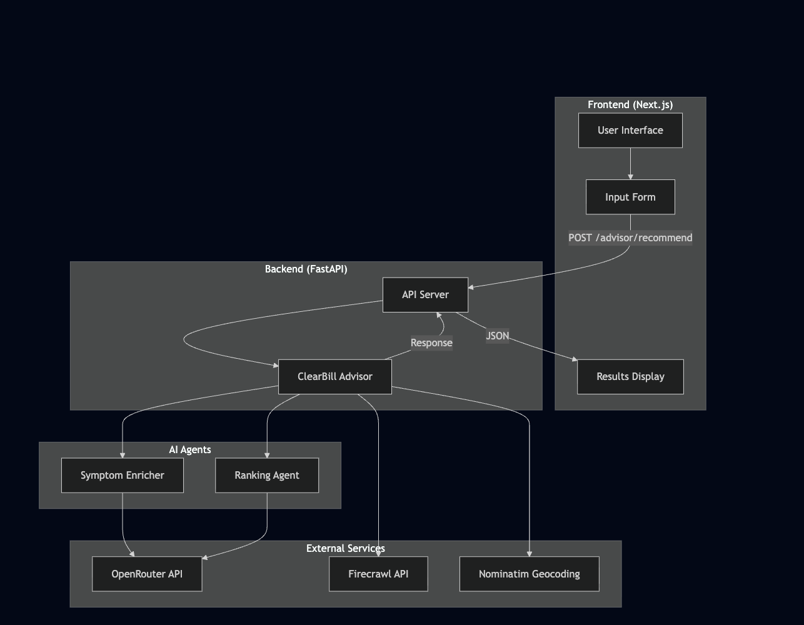
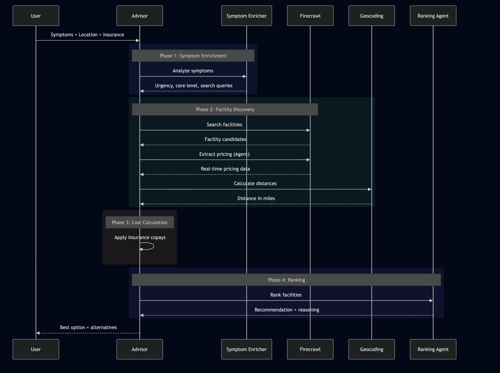
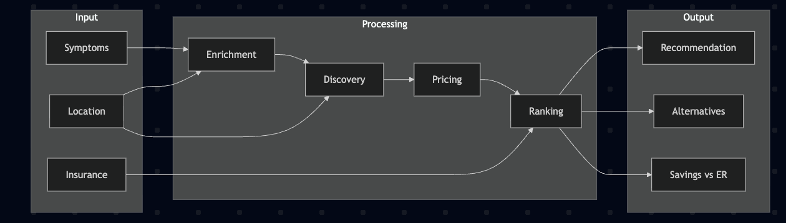
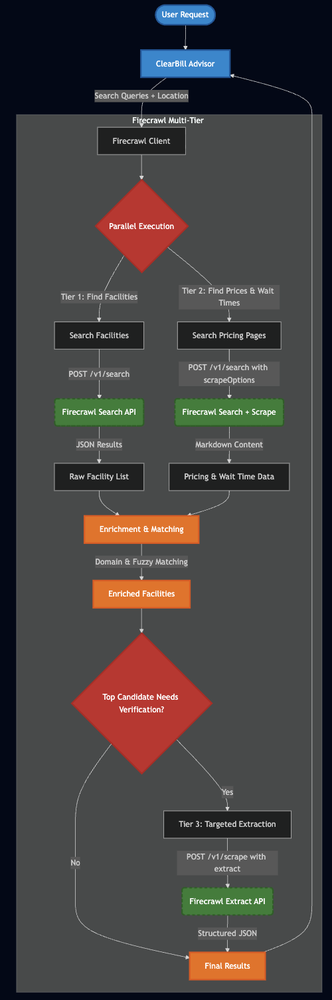
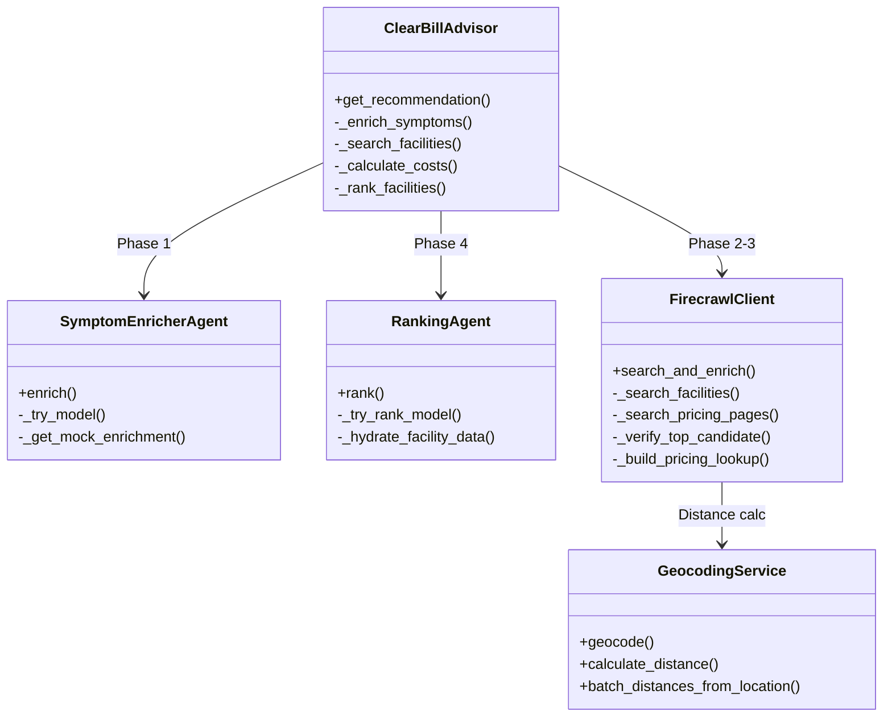
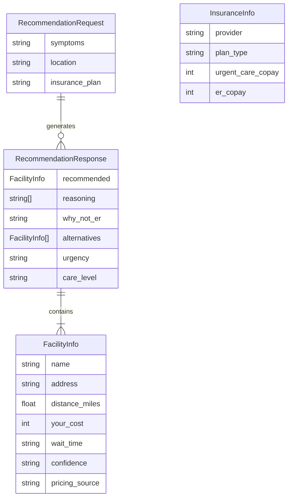

# ClearBill Advisor

> A healthcare vertical agent that tells you where to go and what you'll pay—in seconds.

## The Problem

45 million Americans don't know where to go for care or what it will cost. This leads to $700+ ER bills when urgent care would be $145. Healthcare navigation is broken.

## Solution

ClearBill Advisor uses AI agents to analyze symptoms, discover nearby facilities, extract real-time pricing from websites, and recommend the most cost-effective care option personalized to your insurance.

---

## System Architecture

### High-Level Overview



### Multi-Agent Pipeline (4 Phases)



ClearBill uses a **4-phase vertical agent architecture**:

```
┌─────────────────────────────────────────────────────────────────────────────┐
│                           USER INPUT                                         │
│              Symptoms + Location + Insurance Plan                           │
└─────────────────────────────────────────────────────────────────────────────┘
                                    │
                                    ▼
┌─────────────────────────────────────────────────────────────────────────────┐
│  PHASE 1: SYMPTOM ENRICHMENT (OpenRouter - Claude Haiku)                    │
│  ┌─────────────────────────────────────────────────────────────────────┐    │
│  │ • Parse symptoms → Urgency level (low/moderate/high/emergency)      │    │
│  │ • Determine care level → urgent_care / primary_care / ER            │    │
│  │ • Generate optimized search queries for Firecrawl                   │    │
│  │ • List expected procedures (X-ray, splint, exam, etc.)              │    │
│  └─────────────────────────────────────────────────────────────────────┘    │
└─────────────────────────────────────────────────────────────────────────────┘
                                    │
                                    ▼
┌─────────────────────────────────────────────────────────────────────────────┐
│  PHASE 2 & 3: FACILITY DISCOVERY + PRICING (Firecrawl Multi-Tier)           │
│  See "Firecrawl Integration" section for detailed breakdown                 │
└─────────────────────────────────────────────────────────────────────────────┘
                                    │
                                    ▼
┌─────────────────────────────────────────────────────────────────────────────┐
│  PHASE 4: RANKING & RECOMMENDATION (OpenRouter - DeepSeek R1)               │
│  ┌─────────────────────────────────────────────────────────────────────┐    │
│  │ • Compare facilities on cost, distance, wait time                   │    │
│  │ • Apply insurance copay calculations                                │    │
│  │ • Generate recommendation with reasoning                            │    │
│  │ • Explain why ER is not recommended (cost savings)                  │    │
│  └─────────────────────────────────────────────────────────────────────┘    │
└─────────────────────────────────────────────────────────────────────────────┘
                                    │
                                    ▼
┌─────────────────────────────────────────────────────────────────────────────┐
│                           OUTPUT                                             │
│     Recommended Facility + Your Cost + Alternatives + Savings               │
└─────────────────────────────────────────────────────────────────────────────┘
```

### Data Flow



---

## 🔥 Firecrawl Integration: Multi-Tier Price Discovery

ClearBill uses Firecrawl's APIs in a **3-tier strategy** optimized for speed and accuracy:



### Tier 1: Facility Discovery (`/v1/search`)

**Purpose**: Find healthcare facilities matching the user's needs

```python
# firecrawl_client.py - _search_facilities()
response = await client.post(
    f"{self.base_url}/search",
    headers={"Authorization": f"Bearer {self.api_key}"},
    json={
        "query": f"{query} {location}",  # e.g., "urgent care ankle injury San Francisco"
        "limit": 10
    }
)
```

**What it returns**:
- Facility names, URLs, descriptions
- Snippets containing address information
- Used to build initial candidate list

**Optimization**: Also searches for known providers with pricing data (Carbon Health, One Medical) for better coverage.

### Tier 2: Pricing & Wait Time Discovery (`/v1/search` + `scrapeOptions`)

**Purpose**: Find and scrape pages containing pricing and wait time information

```python
# firecrawl_client.py - _search_pricing_pages()
response = await client.post(
    f"{self.base_url}/search",
    headers={"Authorization": f"Bearer {self.api_key}"},
    json={
        "query": f"urgent care wait time current status price cost {location}",
        "limit": 5,
        "scrapeOptions": {
            "formats": ["markdown"],      # Get page content as markdown
            "onlyMainContent": True       # Skip navigation/footers
        }
    }
)
```

**What it extracts via regex patterns**:

| Pattern Type | Examples Matched |
|--------------|------------------|
| **Wait Times** | "Wait time: 15 min", "Current wait: 30 minutes" |
| **Next Available** | "Next available: 2:30 PM" |
| **Pricing** | "Urgent Care Visit: $225", "X-Ray: $85" |
| **Status Indicators** | "Walk-ins welcome", "High volume", "No wait" |

```python
# Pricing extraction patterns
pricing_patterns = [
    (r"(?:Urgent\s*Care\s*(?:Visit)?)[:\s]*\$(\d+)", "urgent_care_visit"),
    (r"(?:X-Ray|X Ray|Xray)[s]?[:\s]*\$(\d+)", "xray"),
    (r"(?:Virtual\s*(?:Urgent\s*Care|Visit))[:\s]*\$(\d+)", "virtual_visit"),
]

# Wait time extraction patterns
wait_time_pattern = r"(?:wait\s*(?:time)?|current\s*wait)[:\s]*(\d+)\s*(?:min(?:utes?)?)"
next_available_pattern = r"(?:next\s*available)[:\s]*(\d{1,2}:\d{2}\s*[AP]M)"
```

### Tier 3: Targeted Verification (`/v1/scrape` + `extract`)

**Purpose**: High-ROI extraction on the single best candidate for verified data

```python
# firecrawl_client.py - _verify_top_candidate()
schema = {
    "type": "object",
    "properties": {
        "wait_time_minutes": {"type": "integer"},
        "wait_time_status": {"type": "string", "enum": ["Low", "Moderate", "High", "No Wait", "Unknown"]},
        "urgent_care_price": {"type": "integer"},
        "insurance_accepted": {"type": "array", "items": {"type": "string"}},
        "services": {"type": "array", "items": {"type": "string"}}
    }
}

response = await client.post(
    f"{self.base_url}/scrape",
    headers={"Authorization": f"Bearer {self.api_key}"},
    json={
        "url": top_candidate_url,
        "formats": ["extract"],
        "extract": {
            "schema": schema,
            "prompt": "Extract the current wait time, cash prices for visits, and insurance accepted."
        }
    }
)
```

**When it's used**: Only when the top-ranked facility lacks "high" confidence pricing data. This optimizes API credits by only performing expensive extraction on the facility we'll recommend.

### Parallel Execution Strategy

Tiers 1 and 2 run **in parallel** for speed:

```python
# firecrawl_client.py - search_and_enrich()
facility_task = self._search_facilities(queries[0], location)
pricing_task = self._search_pricing_pages(location)

facility_results, pricing_results = await asyncio.gather(
    facility_task, 
    pricing_task,
    return_exceptions=True
)
```

### Confidence Scoring & Fallbacks

| Confidence Level | Source | Description |
|------------------|--------|-------------|
| **high** | Website scrape | Price found on facility's actual website |
| **medium** | Name matching | Price from known provider (Carbon Health = $225) |
| **low** | Industry estimates | Fair Health 2024 averages ($270 visit, $180 X-ray) |

```python
# Industry fallback pricing
INDUSTRY_AVERAGES = {
    "urgent_care_visit": 270,
    "xray": 180,
    "lab_work": 150,
    "source": "Fair Health Consumer 2024 averages"
}
```

---

## 📄 Reducto Integration: Medical Bill Dispute System

ClearBill uses Reducto's document intelligence to power a **medical bill dispute feature** that helps users identify overcharges and generate dispute letters automatically.

### The Problem: Medical Bill Overcharges

- **80% of medical bills contain errors** (Medical Billing Advocates of America)
- Average overcharge: **$1,000+** per hospital visit
- Most patients don't dispute because the process is complex
- CPT codes and charge descriptions are intentionally opaque

### Solution: Reducto + Firecrawl Price Comparison

```
┌─────────────────────────────────────────────────────────────────────────────┐
│                        BILL DISPUTE PIPELINE                                 │
└─────────────────────────────────────────────────────────────────────────────┘
                                    │
        ┌───────────────────────────┴───────────────────────────┐
        │                                                       │
        ▼                                                       ▼
┌───────────────────────┐                         ┌───────────────────────┐
│   REDUCTO EXTRACTION  │                         │  FIRECRAWL DISCOVERY  │
│   (Document Intel)    │                         │  (Price Comparison)   │
├───────────────────────┤                         ├───────────────────────┤
│ • Parse PDF/image     │                         │ • Search fair prices  │
│ • Extract line items  │                         │ • Query Medicare rates│
│ • Identify CPT codes  │                         │ • Find local averages │
│ • Parse charges       │                         │ • Get transparency    │
│ • Detect facility     │                         │   page pricing        │
└───────────────────────┘                         └───────────────────────┘
        │                                                       │
        └───────────────────────────┬───────────────────────────┘
                                    │
                                    ▼
                    ┌───────────────────────────────┐
                    │      PRICE COMPARISON         │
                    │      ENGINE                   │
                    ├───────────────────────────────┤
                    │ • Match CPT codes to prices   │
                    │ • Calculate % overcharge      │
                    │ • Flag suspicious charges     │
                    │ • Identify duplicate billing  │
                    └───────────────────────────────┘
                                    │
                                    ▼
                    ┌───────────────────────────────┐
                    │     DISPUTE LETTER            │
                    │     GENERATOR                 │
                    ├───────────────────────────────┤
                    │ • Auto-populate template      │
                    │ • List specific overcharges   │
                    │ • Cite fair price sources     │
                    │ • Calculate total savings     │
                    └───────────────────────────────┘
```

### Step 1: Bill Upload & Reducto Extraction

Users upload their medical bill (PDF, photo, or scanned image). Reducto's document intelligence extracts structured data:

```python
# Endpoint: POST /dispute/upload-bill
@app.post("/dispute/upload-bill")
async def upload_medical_bill(file: UploadFile = File(...)):
    """
    Upload medical bill for dispute analysis.
    Uses Reducto API for document parsing.
    """
    # Send to Reducto for extraction
    reducto_response = await reducto_client.extract(
        file=file,
        schema=MEDICAL_BILL_SCHEMA
    )
    
    return {
        "line_items": reducto_response.line_items,
        "facility": reducto_response.facility_name,
        "total_charged": reducto_response.total,
        "date_of_service": reducto_response.service_date
    }
```

### Reducto Extraction Schema

| Field | Description | Example |
|-------|-------------|---------|
| `facility_name` | Hospital/clinic name | "SF General Hospital" |
| `facility_address` | Facility location | "1001 Potrero Ave, SF, CA" |
| `date_of_service` | Treatment date | "2024-01-15" |
| `line_items[]` | Array of charges | See below |
| `total_billed` | Total amount charged | $2,847.00 |
| `insurance_paid` | Amount covered | $1,200.00 |
| `patient_responsibility` | Amount owed | $1,647.00 |

#### Line Item Schema

| Field | Description | Example |
|-------|-------------|---------|
| `cpt_code` | Standard procedure code | "99284" |
| `description` | Service description | "Emergency Dept Visit, High" |
| `quantity` | Units billed | 1 |
| `unit_price` | Price per unit | $850.00 |
| `total_price` | Line total | $850.00 |

### Step 2: Firecrawl Price Discovery

For each CPT code extracted, ClearBill queries fair market prices using Firecrawl:

```python
# Query fair prices for extracted CPT codes
async def get_fair_prices(cpt_codes: List[str], location: str) -> Dict:
    """
    Use Firecrawl to find fair market prices for procedures.
    """
    fair_prices = {}
    
    for cpt_code in cpt_codes:
        # Search for fair pricing data
        result = await firecrawl.search(
            query=f"CPT {cpt_code} fair price Medicare reimbursement {location}",
            limit=5,
            scrapeOptions={
                "formats": ["markdown"],
                "onlyMainContent": True
            }
        )
        
        # Extract pricing from results
        prices = extract_prices_from_markdown(result)
        fair_prices[cpt_code] = {
            "medicare_rate": prices.get("medicare"),
            "fair_health_avg": prices.get("fair_health"),
            "local_average": prices.get("local_avg"),
            "sources": prices.get("sources", [])
        }
    
    return fair_prices
```

### Step 3: Price Comparison & Overcharge Detection

```python
def analyze_overcharges(bill_items: List[dict], fair_prices: Dict) -> List[dict]:
    """
    Compare billed amounts against fair market prices.
    Flag items with significant overcharges.
    """
    overcharges = []
    
    for item in bill_items:
        cpt = item["cpt_code"]
        billed = item["total_price"]
        
        if cpt in fair_prices:
            fair = fair_prices[cpt]
            fair_avg = fair.get("fair_health_avg") or fair.get("medicare_rate")
            
            if fair_avg and billed > fair_avg * 1.5:  # 50%+ overcharge threshold
                overcharges.append({
                    "cpt_code": cpt,
                    "description": item["description"],
                    "billed_amount": billed,
                    "fair_price": fair_avg,
                    "overcharge_amount": billed - fair_avg,
                    "overcharge_percent": ((billed - fair_avg) / fair_avg) * 100,
                    "sources": fair.get("sources", [])
                })
    
    return overcharges
```

### Step 4: Dispute Letter Generation

ClearBill auto-generates a professional dispute letter with specific overcharge details:

```
┌─────────────────────────────────────────────────────────────────┐
│                    DISPUTE LETTER OUTPUT                         │
├─────────────────────────────────────────────────────────────────┤
│                                                                  │
│  To: SF General Hospital Billing Department                      │
│  Re: Account #12345, DOS: 01/15/2024                            │
│                                                                  │
│  I am writing to dispute the following charges on my bill:       │
│                                                                  │
│  ┌─────────────────────────────────────────────────────────────┐│
│  │ CPT 99284 - ER Visit (High Severity)                        ││
│  │   Billed: $850.00                                           ││
│  │   Fair Price: $425.00 (Fair Health Consumer avg)            ││
│  │   Overcharge: $425.00 (100% above average)                  ││
│  └─────────────────────────────────────────────────────────────┘│
│                                                                  │
│  ┌─────────────────────────────────────────────────────────────┐│
│  │ CPT 71046 - Chest X-Ray (2 views)                           ││
│  │   Billed: $450.00                                           ││
│  │   Fair Price: $125.00 (Medicare reimbursement rate)         ││
│  │   Overcharge: $325.00 (260% above Medicare)                 ││
│  └─────────────────────────────────────────────────────────────┘│
│                                                                  │
│  TOTAL DISPUTED: $750.00                                         │
│                                                                  │
│  I request an itemized bill review and adjustment to reflect     │
│  fair market pricing. Sources cited: Fair Health Consumer,       │
│  CMS Medicare Fee Schedule 2024.                                 │
│                                                                  │
└─────────────────────────────────────────────────────────────────┘
```

### API Response Example

```json
{
  "dispute_analysis": {
    "facility": "SF General Hospital",
    "date_of_service": "2024-01-15",
    "total_billed": 2847.00,
    "total_fair_price": 1425.00,
    "total_overcharge": 1422.00,
    "overcharge_percent": 99.8,
    "line_items_analyzed": 5,
    "items_flagged": 3
  },
  "overcharges": [
    {
      "cpt_code": "99284",
      "description": "Emergency Dept Visit, High Severity",
      "billed": 850.00,
      "fair_price": 425.00,
      "overcharge": 425.00,
      "percent_over": 100.0,
      "source": "Fair Health Consumer 2024"
    },
    {
      "cpt_code": "71046", 
      "description": "Chest X-Ray, 2 Views",
      "billed": 450.00,
      "fair_price": 125.00,
      "overcharge": 325.00,
      "percent_over": 260.0,
      "source": "CMS Medicare Fee Schedule"
    }
  ],
  "dispute_letter": "To: SF General Hospital Billing Department...",
  "estimated_savings": 1422.00,
  "confidence": "high"
}

---

## Tech Stack

### Backend
| Technology | Purpose |
|------------|---------|
| **Python 3.9+** | Core language |
| **FastAPI** | High-performance async API server |
| **OpenRouter** | Multi-agent orchestration (Claude Haiku + DeepSeek R1) |
| **Firecrawl** | Real-time web scraping & price discovery |
| **Reducto** | Medical bill parsing & dispute analysis |
| **Nominatim** | Free geocoding (OpenStreetMap) |
| **Pydantic** | Data validation & serialization |
| **httpx** | Async HTTP client |

### Frontend
| Technology | Purpose |
|------------|---------|
| **Next.js 16** | React framework with App Router |
| **React 19** | UI library |
| **TypeScript** | Type-safe JavaScript |
| **Tailwind CSS v4** | Modern, responsive styling |
| **Framer Motion** | Smooth animations |
| **Lucide React** | Icon library |

### External APIs
| API | Usage |
|-----|-------|
| **OpenRouter** | Claude 3.5 Haiku (triage) + DeepSeek R1 (ranking) |
| **Firecrawl** | `/search` (discovery), `/search+scrape` (content), `/scrape+extract` (verification) |
| **Reducto** | Medical bill OCR, CPT extraction, dispute letter generation |
| **Nominatim** | Address → coordinates, distance calculation |

---

## Project Structure

```
clear-bill/
├── backend/                      # Python FastAPI server
│   ├── main.py                   # API endpoints & middleware
│   ├── advisor.py                # 4-phase orchestration pipeline
│   ├── models.py                 # Pydantic data models
│   ├── openrouter_client.py      # Claude AI agents (Haiku + DeepSeek R1)
│   ├── firecrawl_client.py       # Multi-tier web scraping & price discovery
│   ├── geocoding.py              # Distance calculation service
│   ├── requirements.txt          # Python dependencies
│   ├── test_live_time.py         # Live wait time tests
│   ├── debug_geocoding.py        # Geocoding debug script
│   └── search_results/           # Cached Firecrawl results (JSON)
│
├── frontend/                     # Next.js React app
│   ├── src/
│   │   └── app/
│   │       ├── page.tsx          # Main UI component
│   │       ├── layout.tsx        # Root layout
│   │       ├── globals.css       # Tailwind + custom styles
│   │       └── api/              # API routes (legacy)
│   ├── package.json              # Dependencies
│   └── next.config.ts            # Next.js configuration
│
├── assets/
│   └── diagrams/                 # Architecture diagrams
│       ├── architecture.png      # High-level system overview
│       ├── api-flow.png          # Agent pipeline visualization
│       ├── data-flow.png         # Data flow diagram
│       ├── firecrawl-flow.mermaid        # Firecrawl integration flow
│       └── firecrawl-flow-improved.mermaid  # Detailed Firecrawl flow
│
├── docs/                         # Documentation
│   └── STEP_1_COMPLETION_REPORT.md
│
├── BLUEPRINT.md                  # Detailed architecture spec
├── LIVE_TIME.md                  # Live wait time feature spec
├── README.md                     # This file
└── .env                          # Environment variables
```

---

## Core Components

### Backend Modules



### API Endpoints

| Endpoint | Method | Description |
|----------|--------|-------------|
| `/health` | GET | Service health check |
| `/advisor/recommend` | POST | Main recommendation endpoint |
| `/facilities/search` | GET | Search facilities by location |
| `/ocr/insurance-card` | POST | Insurance card OCR (Reducto) |
| `/demo/scenarios` | GET | Predefined test scenarios |
| `/agent/stream` | WebSocket | Real-time agent progress |

### Data Models



---

## Features

### Symptom Analysis
- 4 urgency levels: low, moderate, high, emergency
- Auto-detection of emergencies (chest pain, stroke, severe bleeding)
- Generates optimized search queries for facility discovery
- Returns expected procedures (X-ray, exam, splint, etc.)

### Facility Discovery
- Real-time search via Firecrawl `/search`
- Extracts facility names, URLs, ratings
- Ranks by distance, ratings, and care type match
- Top candidates sent for deep pricing extraction

### Price Extraction
- **Tier 1**: Facility discovery via `/search`
- **Tier 2**: Content scraping via `/search` + `scrapeOptions`
- **Tier 3**: Targeted extraction via `/scrape` + `extract`
- Confidence scoring: "high" (verified) vs "low" (estimated)
- Pre-cached pricing for major chains (Carbon Health, One Medical)

### Geocoding & Distance
- Free Nominatim API (no key required)
- Haversine formula for accurate distances
- Intelligent fallback: address → city → ZIP
- Pre-populated cache for major Bay Area cities

### Insurance Integration
Supports 11 major insurers with copay lookups:
- Anthem PPO/HMO
- Blue Shield PPO/HMO
- Aetna PPO/HMO
- Cigna PPO/HMO
- UnitedHealth PPO/HMO
- Kaiser Permanente
- Medicare
- Uninsured (cash pricing)

### Live Wait Times
- Regex patterns detect: "Wait time: 15 min", "Next available: 2:30 PM"
- Scrapes facility booking/status pages
- Sources: "verified_live" vs "estimated"

---

## Setup Instructions

### Prerequisites
- Python 3.9+
- Node.js 18+
- API keys for OpenRouter and Firecrawl

### Backend Setup

```bash
# Navigate to backend directory
cd backend

# Create virtual environment
python -m venv venv
source venv/bin/activate  # Windows: venv\Scripts\activate

# Install dependencies
pip install -r requirements.txt

# Run the server
uvicorn main:app --reload --port 8000
```

### Frontend Setup

```bash
# Navigate to frontend directory
cd frontend

# Install dependencies
npm install

# Run the development server
npm run dev
```

### Environment Variables

Create `.env` in the project root:

```bash
# Required
OPENROUTER_API_KEY=sk-or-v1-your_key_here
FIRECRAWL_API_KEY=fc-your_key_here

# Optional (for future features)
REDUCTO_API_KEY=your_reducto_key_here
SUPABASE_URL=your_supabase_url_here
SUPABASE_KEY=your_supabase_key_here
```

---

## Usage

### Web Interface

1. **Enter Symptoms** - Describe your health issue in plain English
2. **Enter Location** - City, ZIP code, or full address
3. **Select Insurance** - Choose your insurance plan from dropdown
4. **Get Recommendation** - See where to go and what you'll pay

### API Usage

```bash
curl -X POST http://localhost:8000/advisor/recommend \
  -H "Content-Type: application/json" \
  -d '{
    "symptoms": "Twisted ankle, swelling and pain",
    "location": "San Francisco, CA",
    "insurance_plan": "anthem_ppo"
  }'
```

### Response Example

```json
{
  "recommended": {
    "name": "Carbon Health Downtown",
    "address": "123 Market St, San Francisco, CA",
    "distance_miles": 0.8,
    "your_cost": 145,
    "wait_time": "30 min",
    "confidence": "high",
    "pricing_source": "Carbon Health website"
  },
  "reasoning": [
    "Lowest total cost at $145 (vs $850 ER average)",
    "Closest location at 0.8 miles",
    "Shortest wait time",
    "X-ray available on-site"
  ],
  "why_not_er": "Your injury doesn't require emergency care. An urgent care facility can handle ankle injuries with X-rays and splinting at a fraction of the ER cost.",
  "alternatives": [...],
  "urgency": "moderate",
  "care_level": "urgent_care",
  "data_quality": "high",
  "phases": {
    "symptom_enrichment": {"status": "success", "duration_ms": 450},
    "facility_search": {"status": "success", "facilities_found": 5},
    "ranking": {"status": "success", "duration_ms": 380}
  }
}
```

---

## Demo Scenarios

### Scenario 1: Ankle Twist
- **Symptoms**: "Twisted ankle running, swelling and pain"
- **Insurance**: Anthem PPO Silver
- **Result**: Saves $705 by going to urgent care vs ER

### Scenario 2: Sore Throat
- **Symptoms**: "Sore throat 3 days, fever 101°F"
- **Insurance**: Aetna HMO
- **Result**: Highlights facility with best price transparency

### Scenario 3: Uninsured Care
- **Symptoms**: "Cut hand while cooking, bled for 10 min"
- **Insurance**: Self-pay
- **Result**: Balances cost + quality + distance for uninsured

---

## Development Roadmap

- [x] Phase 1: Project Foundation
- [x] Phase 2: Backend API Architecture (FastAPI + endpoints)
- [x] Phase 3: OpenRouter Agent System (Symptom Enricher + Ranking)
- [x] Phase 4: Firecrawl Price Discovery (Search + Agent extraction)
- [x] Phase 5: Geocoding & Distance Calculation
- [x] Phase 6: Agent Orchestration (4-phase pipeline)
- [x] Phase 7: Frontend Dashboard (Next.js + Tailwind)
- [x] Phase 8: Live Wait Time Extraction
- [x] Phase 9: Reducto Bill Dispute Feature
- [ ] Phase 10: WebSocket Agent Visualization
- [ ] Phase 11: Production Deployment

---

## Sponsor Track Relevance

### OpenRouter ($1,000 credits)
- **Vertical agent architecture** - Multi-agent orchestration for healthcare
- **Smart model routing** - Claude Haiku for fast triage, DeepSeek R1 for complex reasoning
- **Intelligent fallbacks** - Haiku → Sonnet → DeepSeek chain
- **15x cost reduction** vs GPT-4 everywhere

### Firecrawl ($5,000 + credits)
- **Multi-tier strategy** - 3-tier approach optimized for speed and accuracy
- **Parallel execution** - Facility + pricing searches run simultaneously
- **Live data extraction** - Wait times, pricing, availability from real websites
- **Structured extraction** - JSON schema-based data extraction via `/scrape` + `extract`
- **Confidence scoring** - Transparent data quality indicators

### Reducto ($1,000 + credits)
- **Medical bill OCR** - Parse PDF/scanned bills into structured line items
- **CPT code extraction** - Identify procedure codes for price comparison
- **Overcharge detection** - Compare billed amounts vs fair market prices (via Firecrawl)
- **Dispute letter generation** - Auto-populate templates with specific discrepancy details
- **Estimated savings** - Average $1,000+ recovered per disputed bill


---

## Testing

```bash
# Run advisor pipeline test
python backend/advisor.py

# Test Firecrawl client
python backend/firecrawl_client.py

# Test OpenRouter agents
python backend/openrouter_client.py

# Test geocoding service
python backend/geocoding.py

# Test live wait time extraction
python backend/test_live_time.py
```

---

## Team

Built for SF Hackathon 2026

---

## License

MIT License - See LICENSE file for details
